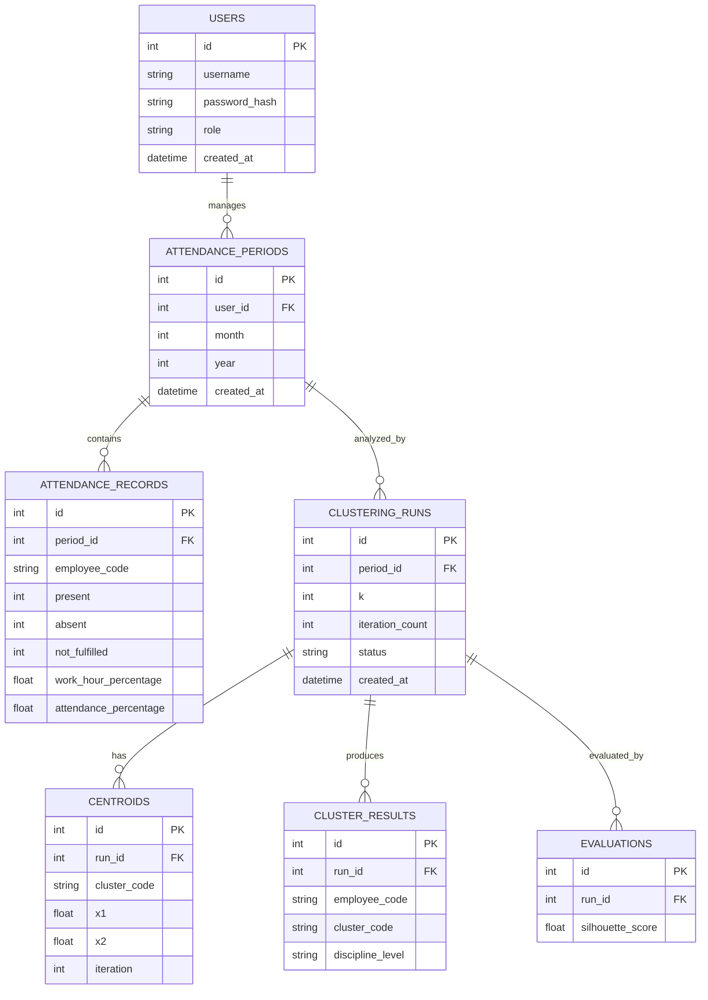

# Entity Relationship Diagram

```mermaid
erDiagram
    USERS ||--o{ ATTENDANCE_PERIODS : manages
    ATTENDANCE_PERIODS ||--o{ ATTENDANCE_RECORDS : contains
    ATTENDANCE_PERIODS ||--o{ CLUSTERING_RUNS : analyzed_by
    CLUSTERING_RUNS ||--o{ CENTROIDS : has
    CLUSTERING_RUNS ||--o{ CLUSTER_RESULTS : produces
    CLUSTERING_RUNS ||--o{ EVALUATIONS : evaluated_by

    USERS {
        int id PK
        string username
        string password_hash
        string role
        datetime created_at
    }

    ATTENDANCE_PERIODS {
        int id PK
        int user_id FK
        int month
        int year
        datetime created_at
    }

    ATTENDANCE_RECORDS {
        int id PK
        int period_id FK
        string employee_code
        int present
        int absent
        int not_fulfilled
        float work_hour_percentage
        float attendance_percentage
    }

    CLUSTERING_RUNS {
        int id PK
        int period_id FK
        int k
        int iteration_count
        string status
        datetime created_at
    }

    CENTROIDS {
        int id PK
        int run_id FK
        string cluster_code
        float x1
        float x2
        int iteration
    }

    CLUSTER_RESULTS {
        int id PK
        int run_id FK
        string employee_code
        string cluster_code
        string discipline_level
    }

    EVALUATIONS {
        int id PK
        int run_id FK
        float silhouette_score
    }
```
