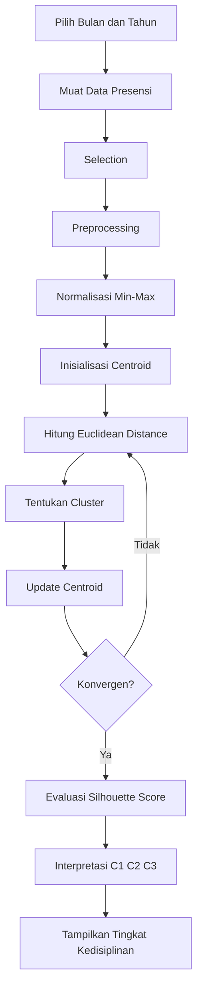

# User Flow

```mermaid
flowchart TD
    A[Pilih Bulan dan Tahun] --> B[Muat Data Presensi]
    B --> C[Selection]
    C --> D[Preprocessing]
    D --> E[Normalisasi Min-Max]
    E --> F[Inisialisasi Centroid]
    F --> G[Hitung Euclidean Distance]
    G --> H[Tentukan Cluster]
    H --> I[Update Centroid]
    I --> J{Konvergen?}
    J -- Tidak --> G
    J -- Ya --> K[Evaluasi Silhouette Score]
    K --> L[Interpretasi C1 C2 C3]
    L --> M[Tampilkan Tingkat Kedisiplinan]
```
